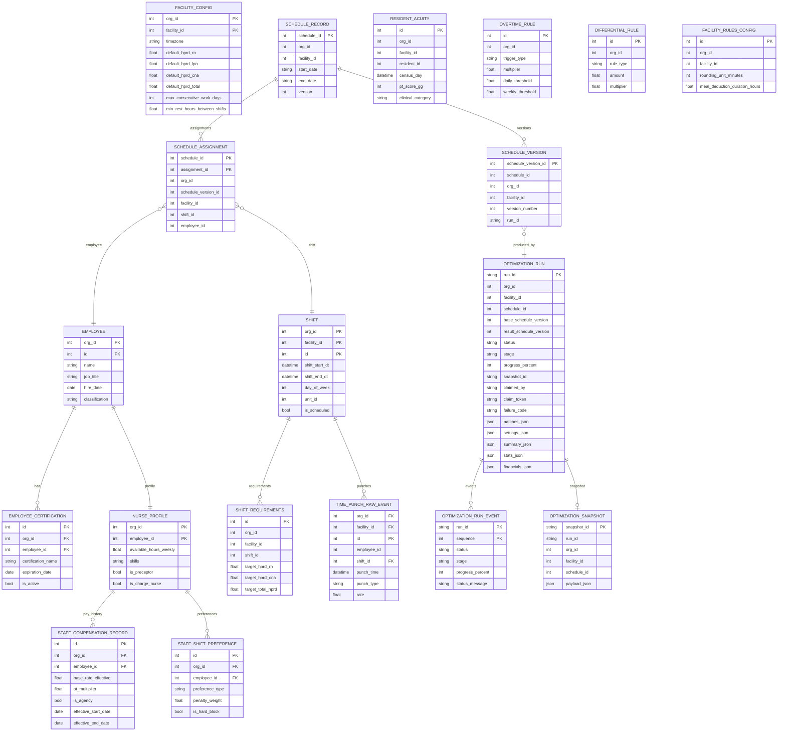
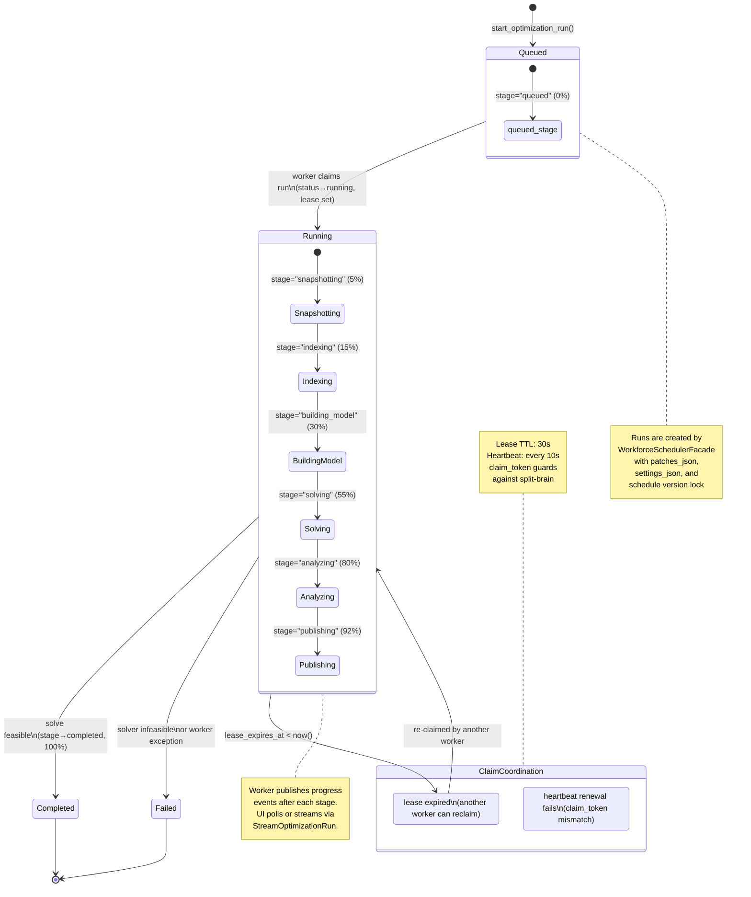

# Backend Architecture

## Entity Relationship Diagram

All tables are scoped by `org_id` via PostgreSQL Row-Level Security unless noted otherwise.
Formal foreign keys exist at the SQL level for certification, compensation, preference, and time-punch
relationships. Other relationships are logical/referential (joined in application code by ID columns).

**Notes:**
- `FACILITY_CONFIG`, `SHIFT`, `SHIFT_REQUIREMENTS`, and `RESIDENT_ACUITY` are scoped by `(org_id, facility_id)`.
- `StagedSchedulePatch`, `OptimizationSettings`, `OptimizationSummary`, `OptimizationStats`, and
  `FinancialReport` are stored as JSON columns inside `optimization_run`, not as separate tables.
- `MinMandates` is derived dynamically from `FACILITY_CONFIG` at solve time.
- Tables without RLS: `optimization_run_event` (scoped by parent `optimization_run` which has RLS),
  `overtime_rules_config` (legacy), `idempotency_key` (global).

---

## OptimizationRun State Diagram

The optimization run is the central long-running workflow. It is created by the
`WorkforceSchedulerFacade` and executed by a pool of worker processes using a lease-based
claim mechanism to prevent duplicate execution.

### Status & Stage Enums

| Status    | Terminal? | Stage values during this status                         |
|-----------|-----------|---------------------------------------------------------|
| `queued`    | No        | `queued`                                                |
| `running`   | No        | `snapshotting` → `indexing` → `building_model` → `solving` → `analyzing` → `publishing` |
| `completed` | Yes       | `completed`                                             |
| `failed`    | Yes       | `failed`                                                |
| `cancelled` | Yes       | (defined in enum, not yet implemented)                  |

### Failure Codes

| Failure Code              | Trigger                                              |
|---------------------------|------------------------------------------------------|
| `snapshot_build_failed`   | Could not construct optimization snapshot            |
| `baseline_infeasible`     | Existing schedule violates hard constraints          |
| `solver_infeasible`       | CBC solver found no feasible solution                |
| `solver_timeout`          | Solver exceeded time limit                           |
| `solver_error`            | Unexpected solver failure                            |
| `publish_conflict`        | Schedule version changed during publishing           |
| `publish_failed`          | Result persistence failed                            |
| `worker_error`            | Unhandled exception in worker process                |

### Worker Claim Flow

1. Worker generates a random `claim_token` and 30-second `lease_expires_at`.
2. SQL query atomically claims the next `queued` run (or any `running` run with expired lease).
3. Worker starts a background heartbeat task (renews lease every 10 seconds).
4. Worker executes the optimization phases, publishing progress events after each stage.
5. On completion or failure, worker releases the claim (clears `claimed_by`, `claim_token`, `lease_expires_at`).
6. If heartbeat renewal fails (`claim_token` mismatch), the worker stops — another worker claimed the run.

### Solver Phases

| Phase            | What happens                                                   |
|------------------|----------------------------------------------------------------|
| **Snapshotting** | Serialize current schedule, employees, shifts, config as JSON   |
| **Indexing**     | Build lazy scenario data index (employee/shift lookups)         |
| **Building Model** | Create binary decision variables (nurse↔shift) + pay buckets |
| **Solving**      | Run CBC ILP solver with hard constraints + soft penalties       |
| **Analyzing**    | Post-solve: extract assignments, compute metrics, detect conflicts |
| **Publishing**   | Write result schedule to `schedule_record` + `schedule_version`  |
