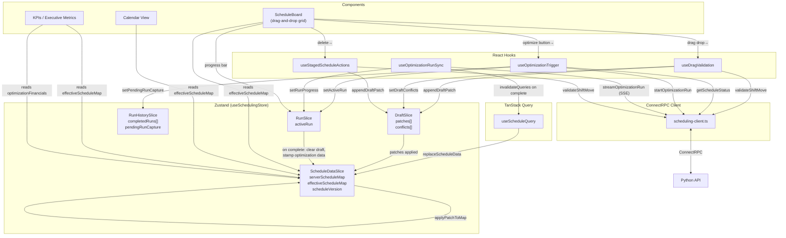

# SNF Schedule Optimizer UI

This app is the frontend for the SNF Schedule Optimizer demo.

It presents the product surface for schedule review, schedule interaction, scenario analysis, and related demo dashboards.

## What The UI Does

- loads monthly schedule data from the backend
- renders scheduling views in list and timeline formats
- provides interaction patterns for schedule review and nurse detail inspection
- includes a scenario analyzer dashboard for product-demo storytelling
- includes an ML forecasts dashboard for future-facing product direction

## Stack

- Next.js 16
- React 19
- TypeScript
- TanStack Query
- Zustand
- ConnectRPC web client

## Install

This repo currently uses `pnpm` in the UI project.

```bash
pnpm install
```

## Run Locally

Start the dev server:

```bash
pnpm dev
```

Open:

```text
http://localhost:3000
```

## Environment

The UI uses `NEXT_PUBLIC_API_BASE_URL` for the backend base URL.

Example:

```bash
NEXT_PUBLIC_API_BASE_URL=http://localhost:8080
```

If not provided, the UI now fails fast during startup so backend targeting is always explicit.

For the default host-dev loop, `just dev-ui` currently points at `http://localhost:8000` unless you override `NEXT_PUBLIC_API_BASE_URL` yourself.

### LAN / Remote Browser Development

If you open the dev UI through a LAN address like `http://192.168.5.101:3000`, Next.js needs the host allowlisted for dev asset requests:

```bash
NEXT_PUBLIC_API_BASE_URL=http://192.168.5.101:8000 NEXT_ALLOWED_DEV_ORIGINS=192.168.5.101 just dev-ui
```

The backend also needs the full browser origin in CORS. Run the backend with:

```bash
EXTRA_DEV_ORIGINS=http://192.168.5.101:3000 just dev-be
```

Use comma-separated values for multiple LAN IPs or hostnames. Restart the UI dev server after changing `NEXT_PUBLIC_API_BASE_URL` because it is compiled into the browser bundle.

Managed Playwright and scenario E2E runs do not rely on implicit localhost defaults. They inject both `PLAYWRIGHT_BASE_URL` and `NEXT_PUBLIC_API_BASE_URL` explicitly and run against an isolated local stack.

## Full Product Demo

For the recommended end-to-end demo path, you can invoke the repo-root compose file from this directory:

```bash
docker compose -f ../compose.demo.yml up --build -d
```

That path runs the UI against the backend and seeded demo data automatically.

For the fastest local edit loop, use the root `justfile` and run the UI on the host with `just dev-ui` instead of rebuilding the demo container on every change.

## Data Flow



### Store Persistence

The scheduling store is persisted to `localStorage` (key `"snf-scheduling-store"`, version 2).
Only `draftState`, `activeRun`, `completedRuns`, and `pendingRunCapture` survive page reloads.
Server schedule data and metrics are re-fetched from the API on mount.

### Patch Application

The `effectiveScheduleMap` is always `serverScheduleMap + draftState.patches`, recomputed
on every store mutation via `applyPatchToMap()`. This means draft edits appear in the UI
immediately, without waiting for an optimization run.

## Important UI Areas

- `app/`: route entrypoints
- `components/`: dashboards, schedule board, modals, supporting UI
- `hooks/`: API fetching and scheduling interactions
- `store/`: client state with Zustand
- `api/`: ConnectRPC client setup
- `gen/`: generated protobuf TypeScript output

## Current Integration Status

The UI now uses the real backend for monthly schedule loading.

Current real integration:

- `hooks/use-schedule-query.ts` loads facility context and monthly schedules from the API
- `api/scheduling-client.ts` uses the generated ConnectRPC client and configurable base URL

Still demo-oriented:

- the scenario analyzer dashboard currently uses mocked calculations and mocked results
- the ML forecasts area is currently presentation-oriented
- some scheduling interactions still assume demo-shaped response data

## Common Commands

Start dev server:

```bash
pnpm dev
```

Build:

```bash
pnpm build
```

Start production build:

```bash
pnpm start
```

Lint:

```bash
pnpm lint
```

## Notes For Contributors

- schedule loading depends on generated protobuf artifacts under `gen/`
- the backend contract lives in `../proto/`
- the root `compose.demo.yml` is the easiest way to verify the real product-demo flow
- the root `compose.dev.yml` plus `just dev-ui` and `just dev-be` is the recommended local development path
